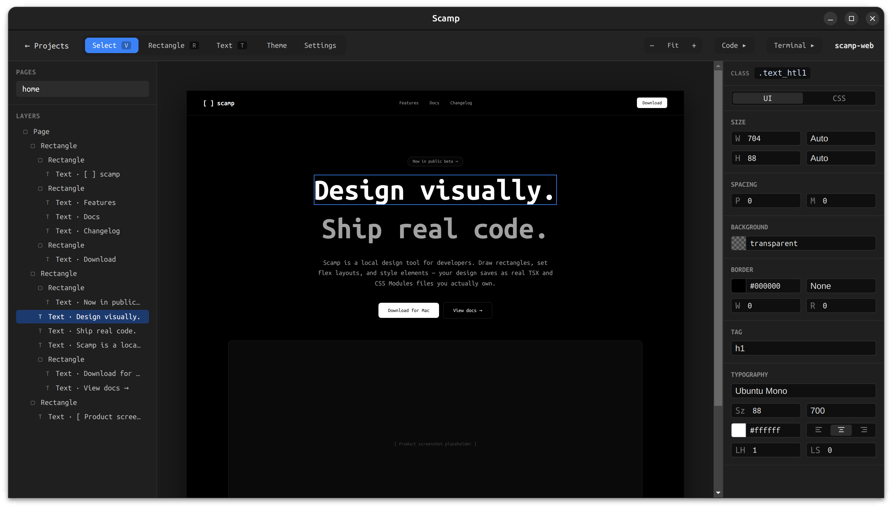
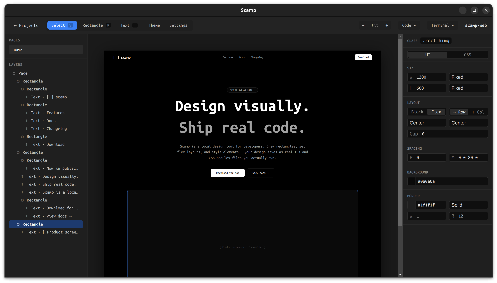
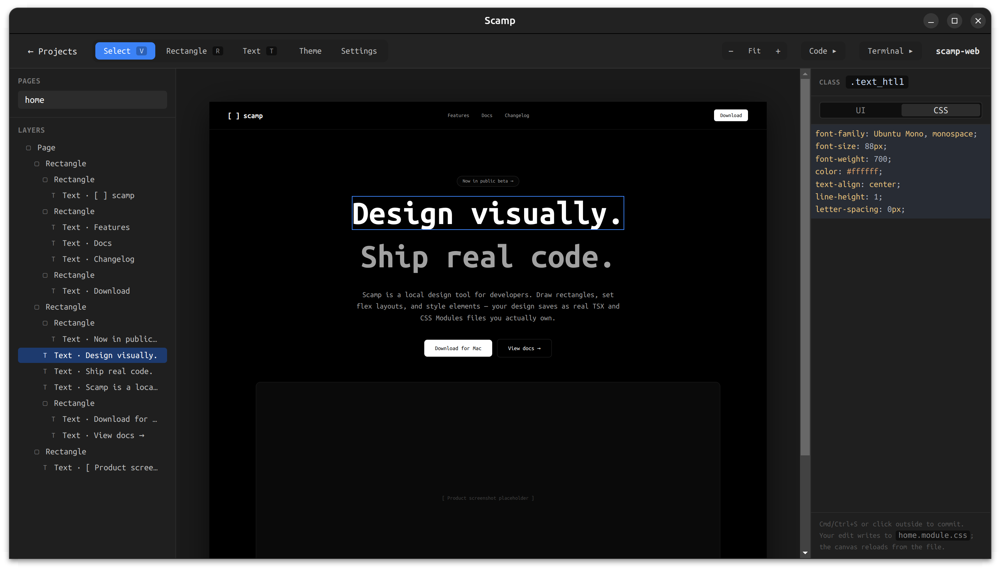
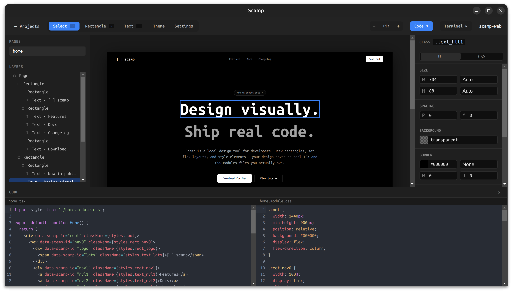
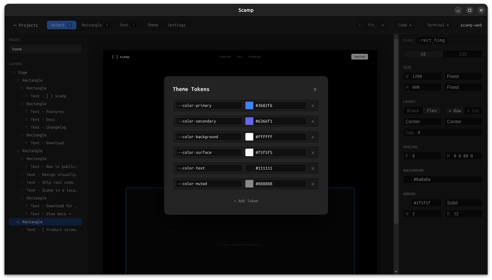
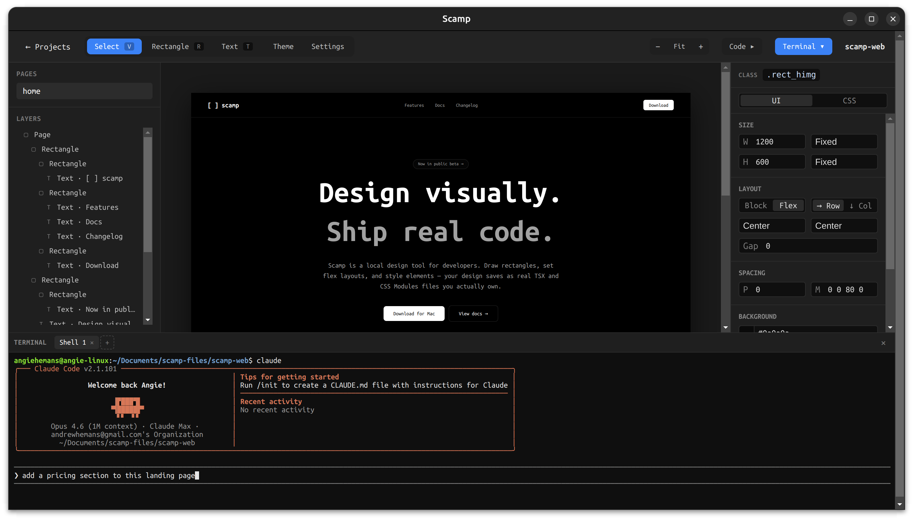

# Scamp

A local-first design tool that lets you visually compose layouts and the output is real code — each page saves as a `.tsx` file plus a `.module.css` file that update in real time as you design. External edits (by hand or by an AI agent) reload the canvas instantly, making it a true bidirectional design-to-code workflow.

🌐 **Website:** [www.scampdesign.app](https://www.scampdesign.app)

## Demo

[](https://youtu.be/SOIzj25OM0Q)

### Screenshots

The canvas with a simple page laid out:



Drawing rectangles and editing properties:



The CSS-mode editor on the properties panel:



The live code preview panel showing the generated TSX + CSS module:



The theme-tokens panel for project-wide design tokens:



The integrated terminal panel:



## Stack

- **Electron** + **electron-vite** — desktop shell with native file system access
- **React 18** + **TypeScript** (strict) — UI
- **Zustand** — canvas state
- **CSS Modules** — app styling
- **chokidar** — file watching for bidirectional sync
- **react-color** — color picker (SketchPicker, dark mode)
- **Vitest** — unit + integration tests

## Repo layout

```
src/
├── main/                  Electron main process
│   ├── index.ts             entry, BrowserWindow setup
│   ├── watcher.ts           chokidar wrapper, write-suppression set
│   └── ipc/                 one file per IPC domain
│       ├── project.ts       choose folder, create/open project
│       ├── file.ts          atomic write + class-block patch
│       ├── page.ts          page create/delete
│       ├── terminal.ts      node-pty terminal management
│       ├── settings.ts      persistent app settings
│       └── recentProjects.ts  recent projects store
├── preload/               contextBridge exposing window.scamp
├── shared/                code shared by main/preload/renderer
│   ├── ipcChannels.ts       channel name constants — never hardcode
│   ├── types.ts             IPC payload types
│   └── agentMd.ts           agent.md template + default page files
└── renderer/              React app
    ├── lib/                 pure functions (generateCode, parseCode,
    │                        cssPropertyMap, defaults, element type)
    ├── store/               Zustand slices (canvasSlice)
    └── src/
        ├── App.tsx
        ├── syncBridge.ts    debounced canvas → file sync
        ├── canvas/          viewport, element renderer, interaction layer
        └── components/
            ├── controls/    NumberInput, ColorInput, EnumSelect,
            │                SegmentedControl, FourSideInput
            ├── sections/    BackgroundSection, SpacingSection, BorderSection,
            │                SizeSection, LayoutSection, PositionSection,
            │                TagSection, TypographySection
            ├── StartScreen, ProjectShell, SettingsPage
            ├── PropertiesPanel (UI/CSS toggle), CssPanel, UiPanel
            ├── ElementTree, Toolbar, ZoomControls, CodePanel
            └── TerminalPanel, TerminalView
test/                       Vitest unit + integration tests
```

## Scripts

```bash
npm run dev             # launch the Electron app with HMR
npm run build           # production build into out/
npm run package         # build + package into dist/ (installer)
npm run typecheck       # tsc --noEmit (node + web projects)
npm run test            # all tests
npm run test:unit       # unit only
npm run test:integration  # integration only
npm run test:watch      # watch mode
```

## Packaging

To create a distributable installer:

```bash
npm run package
```

This runs `electron-builder` which produces platform-specific installers in the `dist/` folder:

| Platform | Output |
|---|---|
| Linux | `.AppImage` + `.deb` |
| macOS | `.dmg` + `.zip` |
| Windows | `.exe` (NSIS installer) + portable `.exe` |

You can only build for your current platform (e.g. you can't build a `.dmg` on Linux). For cross-platform builds, use CI (GitHub Actions, etc.).

The config lives in `electron-builder.yml` at the repo root.

## Features

### Canvas & drawing
- 1440×900 canvas that scales to fit, with manual zoom (discrete steps via Cmd/Ctrl +/-) and horizontal + vertical scrolling when zoomed in
- Rectangle tool — click-drag to create; nested rects draw inside the deepest rect under the cursor
- Text tool — click to place, inline contentEditable editing
- Select tool — click to select, drag to move, 8 resize handles, shift-click for multi-select
- Element tree (layers panel) with drag-and-drop reordering, grouping, and ungrouping
- Keyboard shortcuts: `V` select, `R` rectangle, `T` text, `Cmd+D` duplicate, `Backspace` delete

### Properties panel
- **UI mode** — WYSIWYG editing with typed controls grouped into sections:
  - Position (x, y — hidden for flex children)
  - Size (width/height with Fixed, Stretch, Fit content, Auto modes)
  - Layout (Block/Flex toggle, direction, align, justify, gap)
  - Spacing (padding and margin with linked/expanded four-side input)
  - Background (color picker with hex + rgba support)
  - Border (width, style, color, radius)
  - Tag (semantic HTML tag selector for text elements)
  - Typography (font family from Google Fonts + web-safe, size, weight, color, align, line-height, letter-spacing)
- **CSS mode** — raw CodeMirror editor with CSS syntax highlighting, autocompletion, and Cmd+S to commit
- Toggle between UI and CSS modes; both read the same store so switching is instant and lossless

### Code generation & sync
- `generateCode` — pure function producing real TSX + CSS module from canvas state
- `parseCode` — inverse of generateCode, reads TSX + CSS back into canvas state
- Round-trip invariant: generateCode → parseCode reproduces the original state
- Debounced canvas → file writes via the sync bridge
- chokidar watches for external file edits and reloads the canvas
- `customProperties` passthrough — CSS properties the canvas doesn't model are preserved verbatim through the round-trip

### Project management
- Full-window start screen with sidebar navigation and recent projects list
- Create new projects with validated names in a configurable default folder
- Open existing projects via native folder dialog
- Recent projects persisted across sessions, with missing-folder detection
- Multi-page support — create and delete pages, each gets its own TSX + CSS pair
- Auto-generated `agent.md` for AI agent interop

### Settings
- Accessible from both the start screen and project toolbar
- Default projects folder
- Artboard background color (the area behind the canvas)

### Terminal
- Integrated terminal panel (xterm.js + node-pty)
- Up to 3 tabs, persisted across panel toggles
- Error recovery: terminal failures are surfaced inline instead of silently failing

## Conventions

- Strict TypeScript — no `any`, all function signatures explicit
- IPC channel names live in `src/shared/ipcChannels.ts` — never hardcoded
- The renderer never reads from disk — every file operation goes through IPC
- Path aliases: `@renderer`, `@lib`, `@store`, `@shared`
- Anything in `src/renderer/lib/` must have meaningful test coverage (see CLAUDE.md)
- Ubuntu Mono font across the entire app UI

## License

Business Source License 1.1 (BSL). See `LICENSE` for the full terms.
